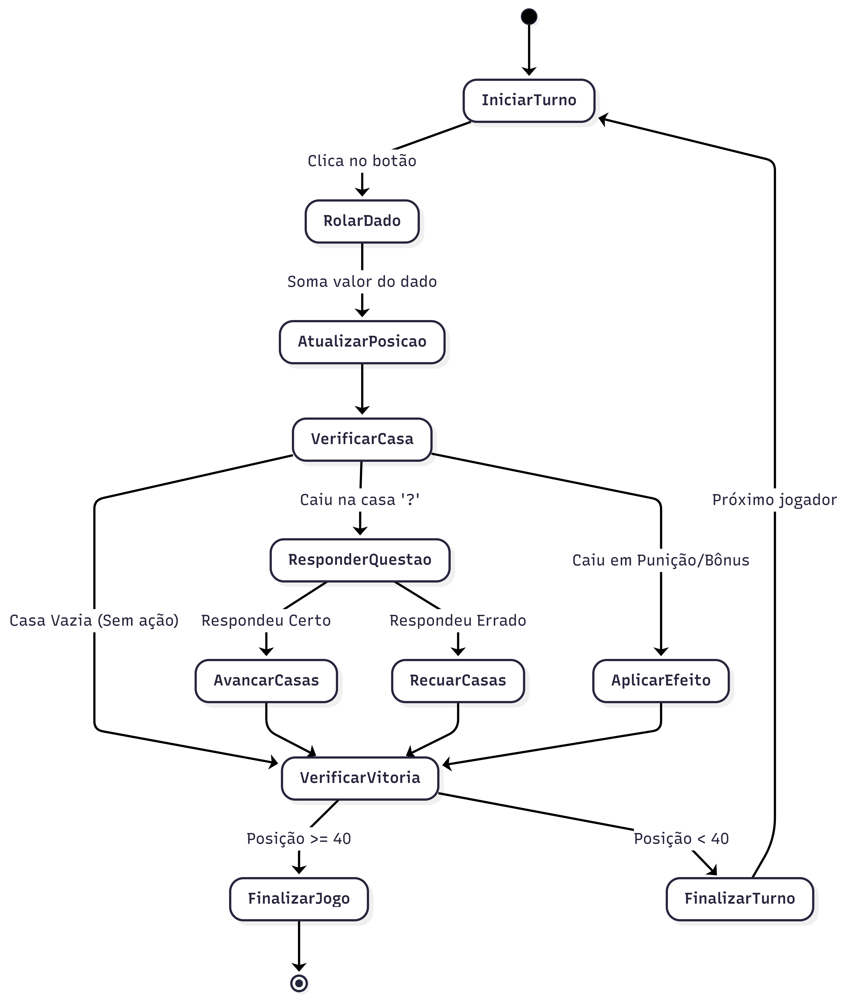
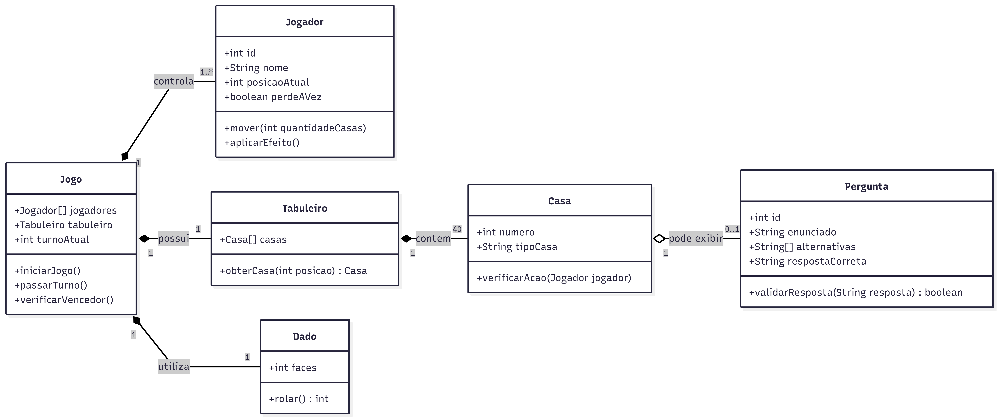

# 🎲 Maratona de Geometria Descritiva (Web App)

## 📌 Sobre o Projeto
Este projeto é a primeira etapa do Trabalho de Conclusão de Curso (TCC) em Ciência da Computação. O objetivo é transpor um jogo de tabuleiro físico educativo, focado no ensino lúdico de Geometria Descritiva, para o ambiente digital (Web). 

---

## 🏗️ Arquitetura e Engenharia de Software

Para o planejamento inicial do sistema, foram desenvolvidos diagramas UML que mapeiam a lógica, o fluxo de usuário e a estrutura de dados.

### 1. Diagrama de Atividades (Fluxo do Turno)
Mapeia o ciclo de vida de uma rodada, demonstrando a lógica de rolagem de dados, movimentação do peão e a resolução de eventos dinâmicos (casas com punição, bônus ou desafios de geometria).

### 2. Diagrama de Classes (Modelo de Domínio)
Apresenta a estrutura inicial proposta para o motor do jogo. O sistema centraliza o controle na classe `Jogo`, que gerencia o `Tabuleiro`, os `Jogadores` e o carregamento dinâmico das `Perguntas`.

